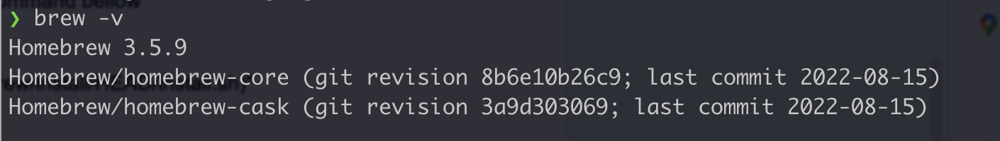
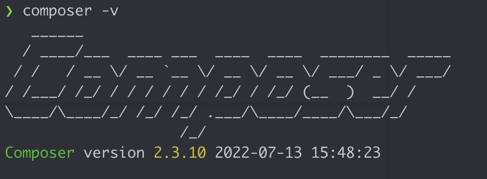
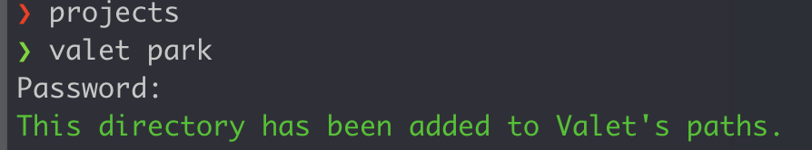
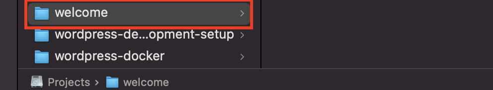

# php-environment-setup-for-mac
PHP environment setup sometime ruins our day. So here is the easiest way to setup Laravel valet on your Mac machine to run PHP or WordPress.
You can follow the guideline bellow or you may read the web version from [WPMiners.com](https://www.wpminers.com)

<i>[Setup Laravel Valet On Mac](https://www.wpminers.com)</i>

# SETTING UP A PHP / WORDPRESS DEVELOPMENT ENVIRONMENT TAKES TEN MINUTES.

You must set up a local server if you have a Mac and want to run PHP or create a local development environment for WordPress. Sometimes, setting that up can destroy our day.

But we can make it easy by doing some tricks. I will show you how to set up a local environment for PHP, Laravel, or WordPress within 5-10 minutes.

You can run your servers using several apps such as xammp, mamp, and wamp. However, we will make use of Laravel Valet.

## What is Laravel Valet?

Laravel Valet is a development environment for macOS minimalists. Laravel Valet configures your Mac always to run Nginx in the background when your machine starts.

To set up the valet server, you must first set up Homebrew.

## What is Homebrew?

Homebrew is a package management application for the Mac. “It’s more like the npm (node package manager) you use to continually update and install or remove your node packages,” for example. Homebrew serves the same purpose as npm on Mac and Linux.

To set up a Mac development environment, we have to install several applications on our device.

> We will install by following steps:
1. Homebrew Installation

2. PHP & MySQL Installation

3. Composer Installation

4. Laravel valet install

# SETUP STARTED:
## 1. INSTALLING HOMEBREW ON MAC:
Open your macOS terminal and run this command bellow

> `/bin/bash -c "$(curl -fsSL https://raw.githubusercontent.com/Homebrew/install/HEAD/install.sh)"`

Use this command to check the Homebrew version. If all goes well, you could see like this.

If it throws any exception, your global path may need to be set up; just follow the instructions on the terminal.

> `brew -v`

Homebrew version check on terminal

## 2. INSTALLING PHP AND MYSQL:
You must have to install PHP if your device has not any. It will be simple using brew command. Run this command on your terminal.

> `brew install php`

Then, if you wish to store your data, you must install MySQL. It is also essential if you want to run WordPress locally.

Run command to install MySQL

> `brew install mysql`

After successfully installing PHP and MySQL, you must run those services. You can run any services using Homebrew with a single command like “brew services start YourServiceName”

For example, you can run MySQL by
> `brew services start mysql`

And to run PHP using:
> `brew services start php`

Recommend:

 To run all services like PHP and MySQL by a single command.

> `brew services restart --all`

This success message will be displayed to let you know whether your service is up and running.

Restarting all services by Homebrew
Restarting all services by Homebrew
After installing PHP, you are ready to install the Composer package manager

## 3. INSTALLING COMPOSER
Composer is also a package manager of PHP like npm or brew. And it is also very easy to install using the brew command.

Run this command below:

brew install composer
To check the successful installation, you can check the version by the command

> `composer -v`

And it will show like this with the current version number.

Composer installed globally
Composer installed globally
Exceptions:

Sometimes it may throw some exceptions cause your composer is not on the global path. To make this happen, you may have to run this command below:

> `sudo mv composer.phar /usr/local/bin/composer`
Then check again by the version is available or not. If you see the version, then your composer setup is done.

## 4. INSTALLING LARAVEL VALET USING COMPOSER
Using composer, you can easily install Laravel Valet. Run the command below

> `composer global require laravel/valet`

After that, you are ready to install valet on your machine.

> `valet install`
## Exception:

    Sometimes you may face this issue Laravel “valet install” not found”

    you need to make sure that <b>~/.composer/vendor/bin</b> directory is in your system’s PATH; you can check this by running `echo $PATH`  To solve this issue, run this command below.

> `export PATH=$PATH:~/.composer/vendor/bin`

<i>Then run again:</i>

> `valet install`

And You are done installing all packages. Now you can use your server; open the directory in your terminal that you want to run with the server. Go to the project directory, Then run this command on the terminal. Laravel valet server is parked. You might be prompted to enter your Mac password; simply input it and press Enter. Then it will appear as follows: You parked your project directory.

Following the execution of the command,

> `valet park`

will validate that your directory has been added to the valet’s path. It appears to be like the image below.

This command will park your project on the server

# How to run projects on your server:

It’s very easy and no need to run every day. It will run automatically for you. Run your project in any browser on your Mac in this manner.

http://Your-project-name.test

Just one thing you have to ensure your projects is in the parked directory. If not, then just add it using the same command: valet park

Example:

Here is my directory, which contains a project called “Welcome” that is already in the parking directory. You can get to it by typing welcome.test into your local browser.

Project directory for valet server
Project directory
Access valet server
Even if You can make this test domain secure by a single command, open your project on the terminal and run this command below, then It will run under SSL now.

> `valet secure`

Making projects secure under SSL you can run like this https://Your-project-name.test
Your server configuration is complete. You can run your PHP , Laravel application using this server. Also, you can run your WordPress locally. If you face any problems, please leave a remark below.